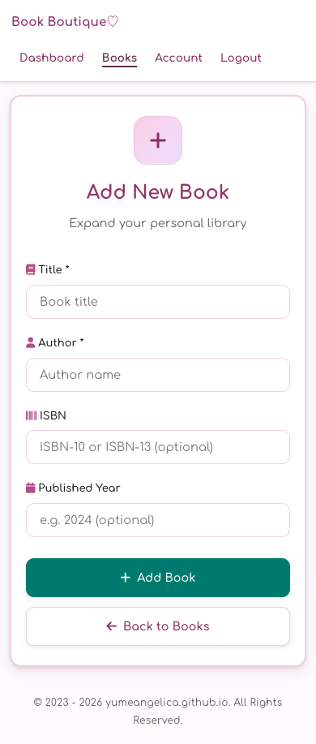

# 📚 Book Boutique

A modern PHP web application for personal book collection management with user authentication, responsive design, and practical security features.

## Screenshots

| Desktop | Mobile |
| --- | --- |
|  |  |
|  |  |
|  |  |

## Features

### Book Management

- Personal book library with full CRUD operations
- User-scoped book access so each account only manages its own library
- ISBN validation with check digit verification (supports ISBN-10 and ISBN-13)
- Optional ISBN and publication year fields
- Client-side and server-side form validation with user-friendly feedback

### Security & Authentication

- User registration with strong password requirements and username format validation
- Real-time password strength validation
- Secure password hashing (PHP password_hash)
- Session ID regeneration after successful login
- Hardened session cookies (HttpOnly, SameSite=Lax, Secure when served over HTTPS, strict mode)
- **Password change functionality** with current password verification
- Account management with secure deletion
- Password confirmation required for account deletion and password changes
- Logout confirmation to prevent accidental sign-outs
- CSRF protection on POST forms
- Destructive book deletion handled with POST requests
- SQL injection protection with prepared statements

### User Experience

- Modern, soft card-based design with muted pink theme
- Mobile-first responsive layout (base styles target small screens, desktop enhanced via min-width media query)
- Top navigation bar for signed-in users with current-page indication
- Interactive user interface with Font Awesome icons
- Real-time client-side validation (forms also work without JavaScript)
- Success flash messages after add/update/delete via the post-redirect-get pattern
- Styled 404 page with a way back into the app
- Dynamic footer component with automatic copyright year updates

### Accessibility

- Semantic landmarks on every page (`header`, `nav`, `main`, `footer`) plus a skip-to-content link
- WCAG 2.2 AA color contrast for text and controls
- Visible keyboard focus states and 44px minimum tap targets
- Decorative icons hidden from screen readers; live regions announce password requirement progress
- Data table with column scopes and a screen-reader caption
- `prefers-reduced-motion` support

### Password Security

- Minimum 8 characters required
- Must contain uppercase and lowercase letters
- Must include numbers and special characters
- Real-time validation with visual indicators and screen-reader announcements
- Client-side checks block obviously invalid submissions; the server always re-validates
- **Secure password change** with current password verification
- Prevention of password reuse (cannot change to same password)

## Requirements

- Docker and Docker Compose
- Git

## Quick Start

1. Clone the repository:

```bash
git clone https://github.com/yumeangelica/book-boutique.git
cd book-boutique
```

2. Copy the example environment file:

```bash
cp .env.example .env
```

3. (Optional) Customize database credentials in `.env` file

4. Start the application:

```bash
docker compose up -d
```

5. Access the application at `http://localhost:8080`

## Database Schema

- **users**: User accounts with secure authentication

  - `id` (Primary Key)
  - `username` (Unique, required)
  - `password_hash` (Secure hash via PHP `password_hash`, currently bcrypt)
  - `created_at` (Timestamp)

- **books**: Personal book records linked to users
  - `id` (Primary Key)
  - `title` (Required, 2-255 characters)
  - `author` (Required, 2-255 characters)
  - `isbn` (Optional, supports ISBN-10/13 with validation)
  - `published_year` (Optional, 1000-current year)
  - `user_id` (Foreign Key with CASCADE delete)
  - `created_at` (Timestamp)

Database features automatic cascade deletion - when a user account is deleted, all their books are automatically removed.

## Application Structure

### Pages & Functionality

- **Login Page**: Secure authentication with error handling
- **Registration**: Strong password requirements with real-time validation
- **Dashboard**: Welcome screen with quick access to features
- **Book Library**: View, add, edit, and delete books
- **Account Management**: User profile with secure account deletion and **password change**
- **Add/Edit Books**: Server-side and client-side form validation with ISBN checking
- **Password Change**: Secure password update requiring current password verification

### Security Features

- All database queries use prepared statements
- Book records are scoped to the authenticated user for viewing, editing, updating, and deletion
- State-changing forms include CSRF tokens
- Password strength validation (frontend + backend)
- Session ID regeneration after login
- **Current password verification** for password changes and account deletion
- Session management with proper cleanup and hardened cookie settings
- Input sanitization and validation (output escaping relies on PHP 8.1+ `htmlspecialchars` defaults, which include `ENT_QUOTES`)
- Username format validation at registration (3-50 chars, letters/numbers/dots/hyphens/underscores)
- Secure password hashing and verification
- **Prevention of password reuse** during password changes

## Technology Stack

- **Backend**: PHP 8.3, MySQL 8.4
- **Frontend**: Custom CSS, Font Awesome 6.7.2, vanilla JavaScript
- **Infrastructure**: Docker, Apache
- **Configuration**: Environment variables (.env)
- **Dependencies**: Composer (vlucas/phpdotenv)

## Project Structure

```
src/
├── Controller/     # Application logic
├── Model/         # Data models and database interaction
└── View/          # UI templates and reusable components
    ├── components/ # Reusable UI components (head, header/nav, footer)
    └── *.php      # Page templates
public/            # Web root and routing
config/            # Application configuration
sql/               # Database initialization
.env.example       # Environment variables template
.env               # Local environment variables (not in git)
```

## Environment Configuration

The application uses environment variables for configuration:

- **DB_HOST**: Database host (default: mysql)
- **DB_NAME**: Database name (default: book_boutique_db)
- **DB_USER**: Database username (default: demo_user)
- **DB_PASS**: Database password (default: demo_password)
- **DB_ROOT_PASSWORD**: MySQL root password (default: demo_root_password)

Copy `.env.example` to `.env` and customize values as needed.

## Development

### Docker Commands

Stop containers:

```bash
docker compose down
```

View logs:

```bash
docker compose logs -f
```

Access MySQL database:

```bash
docker exec -it book-boutique-mysql mysql -u demo_user -pdemo_password book_boutique_db
```

Restart containers:

```bash
docker compose restart
```

### Verification

Validate the Docker configuration:

```bash
docker compose config
```

Validate Composer metadata:

```bash
docker compose exec -T php composer validate --strict
```

Run PHP syntax checks:

```bash
docker compose exec -T php sh -lc 'find public config src -name "*.php" -print0 | xargs -0 -n1 php -l'
```

### Development Notes

- Database tables are automatically created on first run
- Foreign key constraints ensure data integrity
- All forms include both client-side and server-side validation
- Book edit, update, and delete operations are restricted to the authenticated owner
- Password requirements are enforced on both frontend and backend
- **Password change functionality** includes current password verification
- Session security includes proper cleanup and validation
- **Password reuse prevention** ensures users cannot change to their current password
- **Responsive layout structure** with proper flex layout for consistent footer positioning

### Security Notes

- Default demo credentials are provided for local development
- In production, customize the `.env` file with strong, unique passwords
- Database credentials are configurable via environment variables
- Session cookies are set with HttpOnly, SameSite=Lax and strict mode; the Secure flag is applied automatically when the app is served over HTTPS (use HTTPS in production)
- Database connection errors are logged server-side and never exposed to the client
- No login rate limiting or account lockout — intentionally out of scope for this demo application
- Never commit real production credentials to version control

## Manual Installation

If you prefer running without Docker:

1. Install PHP 8.1+, MySQL 8.0+, and Composer
2. Run `composer install`
3. Create `.env` file with database credentials (copy from `.env.example`)
4. Create the database named in `DB_NAME` (default: `book_boutique_db`)
5. Optionally import `sql/init.sql` for the default local schema; the app also creates missing tables on first connection
6. Start with `php -S localhost:8000 -t public`

## Production Deployment

⚠️ **Important for Production:**

1. **Change all default passwords** in `.env` file
2. **Use strong, unique passwords** (at least 16 characters)
3. **Enable HTTPS** with proper SSL certificates
4. **Restrict database access** to application server only
5. **Regular backups** of database
6. **Keep dependencies updated** (`composer update`)
7. **Monitor logs** for security issues

Example production `.env`:

```env
DB_HOST=your-db-host
DB_NAME=book_boutique_production
DB_USER=secure_user_name
DB_PASS=very_secure_random_password_here
DB_ROOT_PASSWORD=another_very_secure_password
```

## Feature Highlights

### Password Security

- **Strong Password Requirements**: Real-time validation ensures passwords contain uppercase, lowercase, numbers, and special characters
- **Visual Feedback**: Green checkmarks appear as requirements are met, with matching screen-reader announcements
- **Submit Protection**: Client-side validation blocks invalid submissions and the server re-validates everything
- **Secure Password Changes**: Current password verification required, prevents password reuse
- **Interactive Password Change**: Hidden form with real-time validation and confirmation matching

### Account Security

- **Secure Account Deletion**: Requires current password confirmation before account deletion
- **Password Change Security**: Current password verification required for password updates
- **CSRF Protection**: POST forms include session-backed CSRF tokens
- **User-Scoped Records**: Book actions are limited to the authenticated owner
- **Logout Protection**: Confirmation dialog prevents accidental logout
- **Data Protection**: Foreign key constraints ensure complete data cleanup
- **Password Reuse Prevention**: System prevents changing to the same current password

### Modern UI

- **Mobile-First Design**: Base styles target small screens; desktop layout is layered on with a single min-width media query
- **Accessible by Design**: WCAG 2.2 AA contrast, skip link, landmarks, keyboard-friendly controls and reduced-motion support
- **Interactive Elements**: Hover effects and smooth transitions throughout
- **Consistent Theming**: Muted pink color palette shared with the author's other projects, defined as CSS custom properties
- **Component Architecture**: Reusable head, header/nav and footer components
- **Card-Based Layout**: Soft, elevated containers for clear content separation

## Credits

Created by **yumeangelica**

## License

This project is licensed under the MIT License - see the [LICENSE](LICENSE) file for details.
