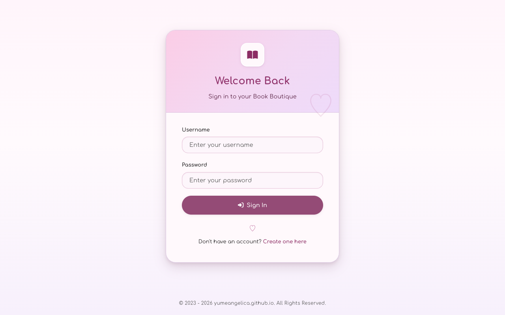
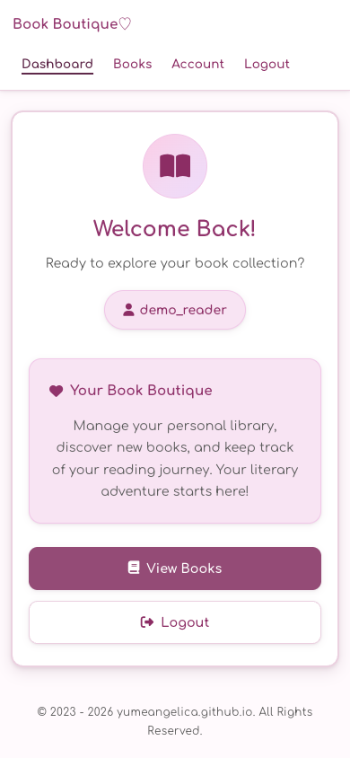
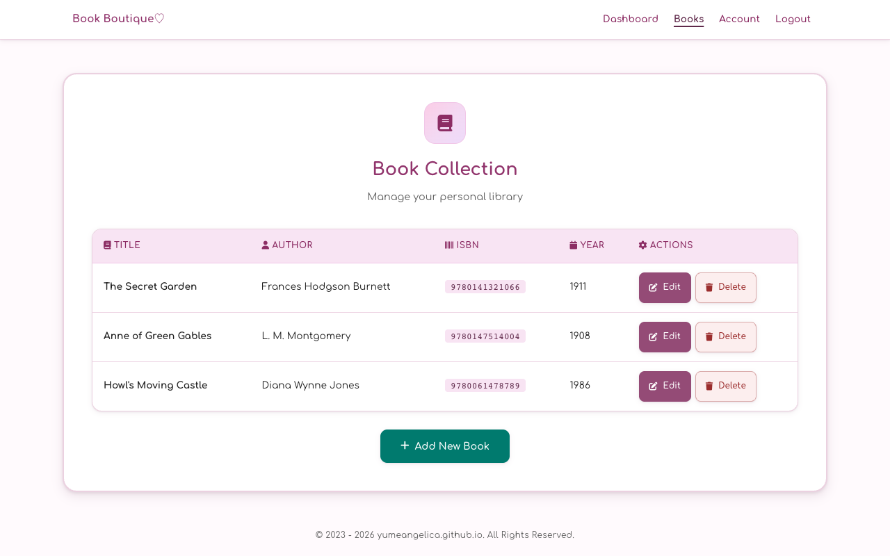
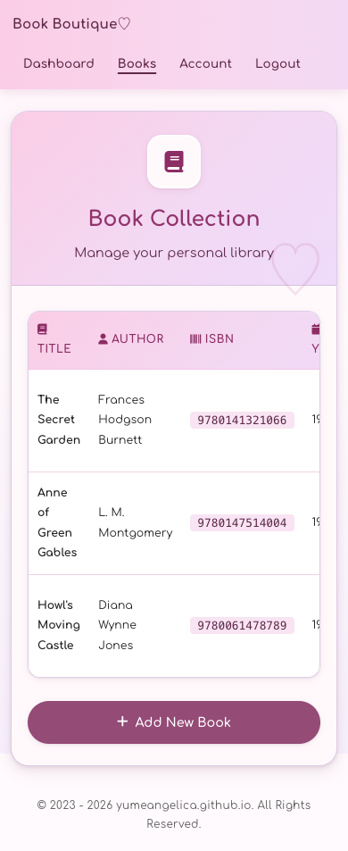

# 📚 Book Boutique

A modern PHP web application for personal book collection management with user authentication, responsive design, and practical security features.

## Screenshots

| Desktop | Mobile |
| --- | --- |
|  |  |
|  |  |

## Features

### Book Management

- Personal book library with full CRUD operations, scoped to the signed-in user
- ISBN-10/13 validation with check digit verification; optional ISBN and publication year
- Client-side and server-side form validation with user-friendly feedback

### Security & Authentication

- Registration with strong password requirements and username format validation (both enforced server-side)
- Password hashing with PHP `password_hash`; current-password verification and reuse prevention on password change; password confirmation for account deletion
- Session ID regeneration after login; hardened session cookies (HttpOnly, SameSite=Lax, strict mode, Secure over HTTPS)
- CSRF tokens on all state-changing forms; destructive actions are POST-only
- Prepared statements for all database queries; consistent output escaping

### User Experience

- Mobile-first responsive layout — base styles target small screens, desktop is layered on with a single min-width media query
- Soft card-based design with a muted pink/lilac palette shared with the author's other projects
- Top navigation bar for signed-in users with current-page indication
- Real-time client-side validation (forms also work without JavaScript)
- Success flash messages via the post-redirect-get pattern; styled 404 page

### Accessibility

- Semantic landmarks on every page (`header`, `nav`, `main`, `footer`) plus a skip-to-content link
- WCAG 2.2 AA color contrast for text and controls
- Visible keyboard focus states and 44px minimum tap targets
- Decorative icons hidden from screen readers; live regions announce password requirement progress
- Data table with column scopes and a screen-reader caption; `prefers-reduced-motion` support

## Technology Stack

- **Backend**: PHP 8.3, MySQL 8.4
- **Frontend**: Custom CSS, Font Awesome 6.7.2, vanilla JavaScript
- **Infrastructure**: Docker, Apache
- **Dependencies**: Composer (vlucas/phpdotenv)

## Quick Start

Requires Docker and Git.

```bash
git clone https://github.com/yumeangelica/book-boutique.git
cd book-boutique
cp .env.example .env   # optionally customize credentials
docker compose up -d
```

The application runs at `http://localhost:8080`.

## Database Schema

- **users**: `id`, `username` (unique), `password_hash`, `created_at`
- **books**: `id`, `title`, `author`, `isbn` (optional), `published_year` (optional), `user_id` (FK, cascade delete), `created_at`

Deleting a user account cascades to their books. The schema lives in `sql/init.sql`; the app also creates missing tables on first connection for the manual install path.

## Project Structure

```
src/
├── Controller/     # Application logic
├── Model/          # Data models and database interaction
└── View/           # Page templates
    └── components/ # Reusable UI components (head, header/nav, footer)
public/             # Web root, routing and styles
config/             # Application configuration
sql/                # Database initialization
.env.example        # Environment variables template
```

## Environment Configuration

Copy `.env.example` to `.env` and customize as needed: `DB_HOST`, `DB_NAME`, `DB_USER`, `DB_PASS`, `DB_ROOT_PASSWORD`.

## Development

```bash
docker compose down       # stop containers
docker compose logs -f    # view logs
docker compose restart    # restart containers
docker exec -it book-boutique-mysql mysql -u demo_user -pdemo_password book_boutique_db
```

### Verification

```bash
docker compose config
docker compose exec -T php composer validate --strict
docker compose exec -T php sh -lc 'find public config src -name "*.php" -print0 | xargs -0 -n1 php -l'
```

The same checks run in CI on every push and pull request.

## Security Notes

- Default demo credentials are for local development only; in production use strong unique passwords, HTTPS, and restricted database access
- The session cookie Secure flag is applied automatically when the app is served over HTTPS
- Database connection errors are logged server-side and never exposed to the client
- Output escaping relies on PHP 8.1+ `htmlspecialchars` defaults, which include `ENT_QUOTES`
- No login rate limiting or account lockout — intentionally out of scope for this demo application

## Manual Installation

If you prefer running without Docker:

1. Install PHP 8.1+, MySQL 8.0+, and Composer
2. Run `composer install`
3. Create `.env` from `.env.example` and a database named in `DB_NAME`
4. Optionally import `sql/init.sql`; the app also creates missing tables on first connection
5. Start with `php -S localhost:8000 -t public`

## Credits

Created by **yumeangelica**

## License

This project is licensed under the MIT License - see the [LICENSE](LICENSE) file for details.
